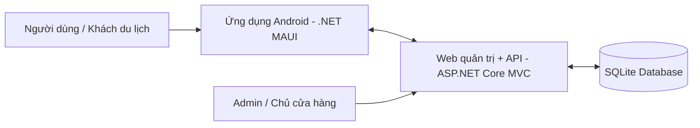

# VKFoodArea

**VKFoodArea** là đồ án xây dựng hệ thống hướng dẫn khám phá ẩm thực đường phố Vĩnh Khánh (Quận 4, TP.HCM) dành cho khách du lịch và người dùng mới.

Hệ thống gồm:
- **Ứng dụng di động Android** viết bằng **.NET MAUI** để hỗ trợ người dùng tra cứu điểm ăn uống, nghe thuyết minh TTS, quét QR và trải nghiệm tour.
- **Web quản trị tích hợp API** viết bằng **ASP.NET Core MVC** để quản lý nội dung, quản lý POI, tour, mã QR, lịch sử nghe và dữ liệu phục vụ demo.

README này được trình bày theo hướng **ngắn gọn, logic, dễ đọc**, phù hợp để giảng viên có thể nắm nhanh mục tiêu, kiến trúc, chức năng và cách chạy dự án.

---

## 1. Mục tiêu dự án

Dự án được xây dựng nhằm giải quyết bài toán:
- Giới thiệu các điểm ăn uống trên phố ẩm thực **Vĩnh Khánh** một cách trực quan.
- Hỗ trợ khách du lịch **nghe thuyết minh tự động** khi đến gần một địa điểm.
- Cho phép **quét QR để mở nhanh nội dung** POI hoặc tour.
- Cung cấp **web quản trị** để cập nhật dữ liệu, quản lý nội dung và theo dõi hoạt động sử dụng.

---

## 2. Bài toán và giá trị học thuật

VKFoodArea không chỉ là một ứng dụng hiển thị danh sách quán ăn, mà là một mô hình hệ thống gồm nhiều thành phần phối hợp:
- **Mobile app** phục vụ trải nghiệm người dùng cuối.
- **CMS/Web quản trị** dành cho admin hoặc chủ cửa hàng.
- **API tích hợp trong web** để đồng bộ dữ liệu cho app.
- **Cơ chế geofence + GPS + QR** để mô phỏng trải nghiệm thực tế.
- **Lịch sử nghe và dữ liệu thiết bị** để phục vụ phân tích sử dụng.

Điểm học thuật nổi bật của đồ án:
- Kết hợp **phát triển ứng dụng di động** và **phát triển web** trong cùng một hệ thống.
- Ứng dụng **SQLite + Entity Framework Core** để quản lý dữ liệu.
- Sử dụng **Mapsui** để hiển thị bản đồ.
- Áp dụng tư duy **workflow thực tế**: dữ liệu nội dung → web quản trị → API → app → lịch sử sử dụng.

---

## 3. Kiến trúc hệ thống

### Tổng quan kiến trúc
Hệ thống VKFoodArea được xây dựng theo mô hình gồm 3 thành phần chính:

- **Ứng dụng mobile Android**: phục vụ người dùng cuối, hỗ trợ xem POI, bản đồ, nghe TTS, quét QR và tham gia tour.
- **Website quản trị tích hợp API**: phục vụ quản lý dữ liệu, quản lý nội dung và cung cấp API cho mobile app.
- **Cơ sở dữ liệu SQLite**: lưu trữ dữ liệu địa điểm, lịch sử nghe, tour, QR và dữ liệu vận hành hệ thống.

---

## 👥 4. Thành viên nhóm

<table>
  <tr>
    <td width="50%" valign="top">
      <h3>Nguyễn Đỗ Đạt</h3>
      
<b>MSSV:</b> 3123411067

      

        Phụ trách <b>phát triển frontend</b> cho ứng dụng mobile và website,
        đồng thời thiết kế <b>trải nghiệm người dùng (UX)</b>.
      

    </td>
    <td width="50%" valign="top">
      <h3>Nguyễn Mạnh Hùng</h3>
      
<b>MSSV:</b> 3123411111

      

        Phụ trách <b>phát triển backend</b> cho ứng dụng mobile và website,
        thiết kế <b>giao diện người dùng (UI)</b>, xây dựng <b>tài liệu PRD</b>
        và hoàn thiện <b>báo cáo dự án</b>.
      

    </td>
  </tr>
</table>

### Cách phối hợp trong dự án

- **Frontend + UX** giúp hoàn thiện trải nghiệm sử dụng trực tiếp của người dùng.
- **Backend + UI + tài liệu PRD** giúp hệ thống có tính hoàn chỉnh cả về kỹ thuật lẫn trình bày học thuật.

Sự phân công này tạo nên một đồ án vừa có **tính triển khai thực tế**, vừa có **chất lượng báo cáo và trình bày**.
    A <--> W[Web quản trị + API - ASP.NET Core MVC]
    W <--> D[(SQLite Database)]
    M[Admin / Chủ cửa hàng] --> W
