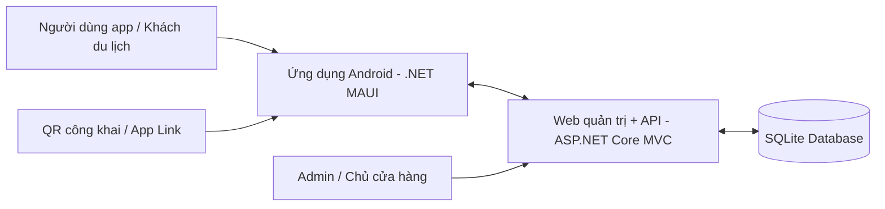

<div align="center">

# 🍜 VKFoodArea

### Hệ thống hướng dẫn khám phá ẩm thực Vĩnh Khánh bằng **Mobile App + Web CMS + API**

<p>
  Đồ án xây dựng trải nghiệm du lịch ẩm thực theo hướng thực tế với <b>GPS</b>, <b>Geofence</b>, <b>QR Code</b>, <b>Tour trải nghiệm</b>, <b>Lịch sử nghe</b>, <b>Movement Log</b> và <b>Theo dõi thiết bị hoạt động</b>.
</p>

<p>
  
  
  
</p>

<p>
  
  
  
  
  
</p>

</div>

---

## 📌 Mục lục

- [1. Giới thiệu dự án](#-1-giới-thiệu-dự-án)
- [2. Mục tiêu dự án](#-2-mục-tiêu-dự-án)
- [3. Giá trị học thuật và điểm nhấn](#-3-giá-trị-học-thuật-và-điểm-nhấn)
- [4. Kiến trúc hệ thống](#-4-kiến-trúc-hệ-thống)
- [5. Thành viên nhóm](#-5-thành-viên-nhóm)
- [6. Chức năng hệ thống](#-6-chức-năng-hệ-thống)
- [7. Công nghệ sử dụng](#-7-công-nghệ-sử-dụng)
- [8. Cấu trúc dự án](#-8-cấu-trúc-dự-án)
- [9. Hướng dẫn chạy dự án](#-9-hướng-dẫn-chạy-dự-án)
- [10. Tài khoản demo](#-10-tài-khoản-demo)
- [11. Định hướng phát triển](#-11-định-hướng-phát-triển)

---

## ✨ 1. Giới thiệu dự án

**VKFoodArea** là hệ thống hướng dẫn khám phá ẩm thực đường phố **Vĩnh Khánh (Quận 4, TP.HCM)** dành cho khách du lịch, người dùng mới và bối cảnh demo học thuật.

Hệ thống được tổ chức theo mô hình **end-to-end** gồm:
- **Ứng dụng di động Android** viết bằng **.NET MAUI** để người dùng xem POI, tìm kiếm, xem bản đồ, nghe narration, quét QR và trải nghiệm tour.
- **Website quản trị/chủ cửa hàng tích hợp API** viết bằng **ASP.NET Core MVC** để quản lý nội dung, quản lý POI, QR, tour, tài khoản nội bộ và dữ liệu vận hành.
- **SQLite Database** để lưu dữ liệu POI, tour, QR, lịch sử nghe, movement log, tài khoản và phiên thiết bị.

Dự án không chỉ dừng ở mức hiển thị quán ăn, mà nhấn mạnh vào tính liên thông giữa **Web → API → App → Dữ liệu sử dụng**, giúp thể hiện rõ logic hệ thống khi demo với giảng viên.

---

## 🎯 2. Mục tiêu dự án

Dự án được xây dựng nhằm giải quyết các mục tiêu sau:

- Giới thiệu các điểm ăn uống trên phố ẩm thực **Vĩnh Khánh** theo cách trực quan, dễ khám phá.
- Hỗ trợ người dùng **xem/tìm POI**, **xem chi tiết**, **nghe thuyết minh thủ công** hoặc **tự động phát theo GPS/geofence**.
- Cho phép **quét QR** hoặc **mở app bằng app link** để vào đúng nội dung POI/tour nhanh hơn.
- Cung cấp **website quản trị/chủ cửa hàng** để cập nhật nội dung, theo dõi trạng thái duyệt và dữ liệu sử dụng.
- Ghi nhận **lịch sử nghe**, **movement log** và **heartbeat thiết bị** để phục vụ dashboard, analytics và chứng minh luồng demo liên thông.
- Tạo ra một sản phẩm có tính học thuật rõ ràng nhưng vẫn mang tính trải nghiệm thực tế.

---

## 🚀 3. Giá trị học thuật và điểm nhấn

<table>
  <tr>
    <td width="50%" valign="top">
      <h3>🎓 Giá trị học thuật</h3>
      <ul>
        <li>Kết hợp <b>phát triển ứng dụng di động</b> và <b>phát triển web</b> trong cùng một hệ thống.</li>
        <li>Ứng dụng <b>SQLite + Entity Framework Core</b> để quản lý dữ liệu.</li>
        <li>Sử dụng <b>Mapsui</b> để hiển thị bản đồ và mô phỏng trải nghiệm không gian.</li>
        <li>Thể hiện luồng dữ liệu rõ ràng từ <b>Web quản trị → API → App → Dữ liệu vận hành</b>.</li>
        <li>Dễ đối chiếu với PRD, use case, ERD và sequence diagram khi báo cáo.</li>
      </ul>
    </td>
    <td width="50%" valign="top">
      <h3>🔥 Điểm nhấn thực tế</h3>
      <ul>
        <li><b>Geofence + GPS</b> để tự phát nội dung khi người dùng đến gần địa điểm.</li>
        <li><b>QR Code + App Link</b> để mở nhanh đúng POI hoặc tour.</li>
        <li><b>Tour trải nghiệm</b> theo lộ trình, có intro tour và ưu tiên current stop.</li>
        <li><b>Lịch sử nghe + movement log + active device</b> phục vụ thống kê và demo.</li>
        <li><b>Owner workflow</b> cho phép chủ cửa hàng cập nhật nội dung trong phạm vi sở hữu và chờ duyệt.</li>
      </ul>
    </td>
  </tr>
</table>

### 💡 Ý nghĩa của đồ án

VKFoodArea không chỉ là một ứng dụng hiển thị quán ăn, mà là một mô hình hệ thống gồm nhiều thành phần phối hợp:
- **Mobile app** phục vụ người dùng cuối.
- **CMS/Web quản trị** dành cho admin hoặc chủ cửa hàng.
- **API tích hợp trong web** để đồng bộ dữ liệu cho app và nhận log ngược từ app.
- **Cơ chế GPS, geofence, QR, app link và tour** để mô phỏng trải nghiệm thực tế.
- **Lịch sử nghe, movement log và device heartbeat** để phục vụ phân tích sử dụng và trình bày luồng demo vàng.

---

## 🏗 4. Kiến trúc hệ thống



### Tổng quan kiến trúc

Hệ thống VKFoodArea được xây dựng theo mô hình gồm 3 lớp chính:

- **Ứng dụng mobile Android**: phục vụ người dùng cuối, hỗ trợ danh sách POI, tìm kiếm, bản đồ, narration, QR, tour, lịch sử nghe và cài đặt.
- **Website quản trị/chủ cửa hàng tích hợp API**: phục vụ đăng nhập, quản lý nội dung, duyệt dữ liệu và cung cấp API cho app.
- **Cơ sở dữ liệu SQLite**: lưu trữ dữ liệu POI, tour, QR, translation, audio asset, lịch sử nghe, movement log, admin user, app user và device session.

### Dòng chảy dữ liệu chính

1. Admin hoặc chủ cửa hàng tạo/cập nhật POI, QR, tour trên web.
2. Dữ liệu được lưu vào SQLite và công bố qua API cho app.
3. App đồng bộ nội dung để hiển thị cho người dùng.
4. Người dùng nghe narration bằng nút bấm, GPS/geofence, QR hoặc tour.
5. App gửi lịch sử nghe, movement log và heartbeat thiết bị ngược về web.
6. Dashboard và analytics tổng hợp dữ liệu để phục vụ quản trị và demo.

---

## 👥 5. Thành viên nhóm

<div align="center">

> **Nhóm phát triển VKFoodArea**  
> Kết hợp giữa **Frontend, Backend, UX/UI, PRD và Báo cáo dự án** để hoàn thiện một hệ thống app + web + API có tính học thuật và thực tiễn.

</div>

<table>
  <tr>
    <td width="50%" valign="top">

<div align="center">

### 👨‍💻 Nguyễn Đỗ Đạt


</div>

**Phụ trách chính**
- Phát triển **frontend** cho ứng dụng mobile.
- Phát triển **frontend** cho website.
- Thiết kế **trải nghiệm người dùng (UX)**.

**Đóng góp nổi bật**
- Tập trung vào phần người dùng trực tiếp nhìn thấy và tương tác.
- Góp phần làm cho sản phẩm dễ tiếp cận, rõ ràng và trực quan hơn khi demo.

</td>
<td width="50%" valign="top">

<div align="center">

### 🧠 Nguyễn Mạnh Hùng


</div>

**Phụ trách chính**
- Phát triển **backend** cho ứng dụng mobile và website.
- Thiết kế **giao diện người dùng (UI)**.
- Xây dựng **tài liệu PRD**.
- Hoàn thiện **báo cáo dự án**.

**Đóng góp nổi bật**
- Đảm nhiệm phần logic hệ thống và tài liệu học thuật.
- Giúp đồ án vừa có chất lượng kỹ thuật, vừa có khả năng trình bày tốt khi báo cáo.

</td>
  </tr>
</table>

### 🤝 Cách phối hợp trong dự án

- **Frontend + UX** giúp hoàn thiện trải nghiệm sử dụng trực tiếp của người dùng.
- **Backend + UI + PRD + báo cáo** giúp hệ thống hoàn chỉnh cả về kỹ thuật lẫn trình bày học thuật.
- Sự phân công này tạo nên một đồ án vừa có **tính triển khai thực tế**, vừa có **điểm mạnh khi thuyết trình với giảng viên**.

---

## 📱 6. Chức năng hệ thống

### 6.1. Chức năng công khai qua QR / tải app

| Chức năng | Mô tả |
|---|---|
| **Resolve QR** | API xác định mã QR đang trỏ đến **POI** hay **Tour** để mở đúng nội dung |
| **Mở app bằng app link** | Trang công khai hỗ trợ deep link để thiết bị đã cài app mở thẳng nội dung liên quan |
| **Tải APK công khai** | Nếu chưa cài app, người dùng có thể được điều hướng đến trang tải APK Android |

### 6.2. Chức năng trên ứng dụng mobile

| Chức năng | Mô tả |
|---|---|
| **Khởi động và chọn ngôn ngữ** | Khởi tạo ứng dụng, phục hồi session và chọn ngôn ngữ trước khi vào hệ thống |
| **Danh sách và tìm kiếm POI** | Hiển thị POI active, hỗ trợ tìm theo từ khóa và gợi ý kết quả gần đúng |
| **Xem chi tiết POI** | Hiển thị tên quán, địa chỉ, mô tả, hình ảnh, nội dung narration và thông tin liên quan |
| **Nghe thủ công** | Người dùng chủ động phát hoặc dừng narration từ danh sách hoặc trang chi tiết |
| **Bản đồ và vị trí hiện tại** | Hiển thị vị trí POI, vị trí hiện tại và hỗ trợ mở full map |
| **GPS / Geofence tự phát** | Tự động phát nội dung khi người dùng đi vào vùng của POI phù hợp |
| **Quét QR** | Quét QR trong app hoặc nhận deeplink từ QR công khai để mở đúng POI/tour |
| **Tour trải nghiệm** | Bắt đầu tour, phát intro, theo dõi current stop và ưu tiên điểm dừng của tour |
| **Lịch sử nghe** | Ghi nhận các lần nghe với source, mode, thời gian và dữ liệu liên quan |
| **Cài đặt âm thanh / ngôn ngữ** | Đổi narration language và playback mode theo các chế độ TTS / Audio / Auto |
| **Hồ sơ / đồng bộ user key** | Duy trì dữ liệu người dùng app và đồng bộ trạng thái cần thiết về web |

### 6.3. Chức năng trên website quản trị

| Chức năng | Mô tả |
|---|---|
| **Đăng nhập quản trị** | Xác thực bằng cookie và phân quyền **Admin** hoặc **RestaurantOwner** |
| **Dashboard tổng quan** | Hiển thị số liệu POI, narration, QR, active device, active user và dữ liệu phục vụ demo |
| **Quản lý POI** | Tạo, sửa, xóa, lọc, tìm kiếm POI; upload hình/audio; quản lý translation |
| **Duyệt / từ chối POI** | Kiểm soát nội dung trước khi công bố cho app |
| **Quản lý tour** | Tạo và cập nhật lộ trình nhiều điểm dừng; kiểm tra điều kiện hợp lệ trước khi active |
| **Quản lý mã QR** | Tạo, sửa, xóa QR và trỏ QR đến đúng POI hoặc tour |
| **Lịch sử nghe** | Tra cứu narration history với nhiều bộ lọc như query, date, language, mode, source |
| **Bản đồ analytics** | Quan sát movement log và dữ liệu sử dụng theo không gian |
| **Quản lý tài khoản hệ thống** | Tạo, sửa, reset password và xóa tài khoản nội bộ |
| **Theo dõi thiết bị hoạt động** | Nhận heartbeat từ app để tính active device phục vụ vận hành và demo |

### 6.4. Chức năng theo vai trò chủ cửa hàng

| Chức năng | Mô tả |
|---|---|
| **Tạo / cập nhật POI trong phạm vi sở hữu** | Chủ cửa hàng chỉ thao tác trên POI của mình và gửi nội dung chờ admin duyệt |
| **Theo dõi lịch sử nghe trong phạm vi sở hữu** | Xem dữ liệu sử dụng của các POI mà mình quản lý |
| **Theo dõi trạng thái duyệt** | Biết POI đang ở trạng thái pending / approved / rejected để chỉnh sửa phù hợp |
| **Dashboard phạm vi sở hữu** | Chỉ xem dữ liệu thống kê liên quan đến các POI thuộc quyền quản lý |

---

## 🧰 7. Công nghệ sử dụng

| Thành phần | Công nghệ |
|---|---|
| Mobile App | .NET MAUI, C# |
| Web CMS + API | ASP.NET Core MVC |
| ORM / Database | Entity Framework Core, SQLite |
| Bản đồ | Mapsui |
| Quét QR | ZXing.Net / ZXing.Net.Maui |
| Âm thanh | Plugin.Maui.Audio |
| Giao tiếp API | HttpClient |
| Môi trường chạy | .NET 10 |

---

## 🗂 8. Cấu trúc dự án

```text
VKFoodArea/
├─ VKFoodArea/               # Ứng dụng Android (.NET MAUI)
│  ├─ Data/
│  ├─ Features/
│  ├─ Models/
│  ├─ Repositories/
│  ├─ Resources/
│  └─ Services/
├─ VKFoodArea.Web/           # Website quản trị + API
│  ├─ Controllers/
│  ├─ Controllers/Api/
│  ├─ Data/
│  ├─ Models/
│  ├─ Services/
│  ├─ ViewModels/
│  ├─ Views/
│  └─ wwwroot/
├─ VKFoodArea.slnx
└─ README.md
```

### Dữ liệu demo trong dự án

Hệ thống có dữ liệu mẫu phục vụ demo như:
- **POI mẫu** thuộc khu vực Vĩnh Khánh
- **tour demo**
- **QR demo**
- **tài khoản admin mặc định** trong môi trường phát triển phù hợp
- **dữ liệu lịch sử/người dùng/thiết bị** phục vụ dashboard và analytics ở mức đồ án

### Một số module đáng chú ý

| Khu vực | Module / ý nghĩa |
|---|---|
| **App** | Startup/Entry, Home/Map, Runtime GPS, Narration, QR/App Link, Tour, Settings/User |
| **Web** | Auth, Dashboard, POI, Tour, QR, History, Analytics, Admin User |
| **API** | Resolve QR, POI, Tour, Narration Histories, Movement Logs, Device Presence, App Users |

---

## ▶️ 9. Hướng dẫn chạy dự án

### 9.1. Yêu cầu môi trường

- **.NET SDK 10**
- Visual Studio / Visual Studio Code / Rider có hỗ trợ .NET
- Android SDK nếu chạy app trên emulator hoặc điện thoại thật
- Thiết bị có quyền **Location** và **Camera** nếu demo GPS/geofence và QR

### 9.2. Chạy website quản trị + API

```bash
cd VKFoodArea.Web
dotnet restore
dotnet run
```

Website quản trị và API được chạy từ cùng một dự án ASP.NET Core MVC.

### 9.3. Chạy ứng dụng Android

```bash
cd VKFoodArea
dotnet restore
dotnet build -f net10.0-android
```

Có thể chạy trên:
- máy ảo Android
- hoặc điện thoại Android thật

### 9.4. Đồng bộ app với web/API

Ứng dụng mobile giao tiếp với web thông qua các API như:
- `GET /api/pois`
- `GET /api/tours`
- `GET /api/resolve-qr?code=`
- `GET/POST/DELETE /api/narration-histories`
- `GET/POST /api/movement-logs`
- `POST /api/device-presence/heartbeat`
- `POST /api/app-users/sync`

Khi demo trên điện thoại thật, cần bảo đảm **base URL** của app có thể truy cập được đến web/API đang chạy, ví dụ qua **LAN IP** hoặc **domain/tunnel công khai**.

### 9.5. Gợi ý luồng demo vàng

1. Mở app và chọn ngôn ngữ.
2. Vào danh sách hoặc tour để chọn nội dung trải nghiệm.
3. Bật GPS và di chuyển đến gần một POI.
4. App tự phát narration theo geofence hoặc theo stop của tour.
5. Kiểm tra lịch sử nghe đã được ghi nhận.
6. Mở web quản trị để xem dashboard, analytics hoặc active device được cập nhật.

---

## 🔐 10. Tài khoản demo

Trong môi trường phát triển, hệ thống có thể seed tài khoản quản trị mặc định:

- **Username:** `admin`
- **Password:** `admin123`

> Có thể thay đổi tùy theo dữ liệu seed và cấu hình môi trường thực tế của nhóm.

---

## 📈 11. Định hướng phát triển

Trong tương lai, hệ thống có thể mở rộng theo các hướng:
- hỗ trợ đa ngôn ngữ sâu hơn cho narration và nội dung POI
- mở rộng thêm nhiều tuyến ẩm thực khác ngoài Vĩnh Khánh
- tối ưu logic geofence, tour và bản đồ để tăng trải nghiệm thực tế
- tách API thành backend độc lập nếu cần triển khai quy mô lớn
- nâng cấp analytics để theo dõi hành vi người dùng chi tiết hơn
- tối ưu giao diện để phù hợp hơn với khách du lịch quốc tế
- mở rộng cơ chế QR/app link để triển khai thực tế ở các điểm dừng công cộng

---

<div align="center">

### VKFoodArea – Academic Project for Food Tourism Experience

</div>
