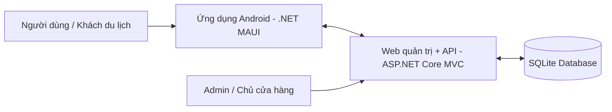

<div align="center">

# 🍜 VKFoodArea

### Hệ thống hướng dẫn khám phá ẩm thực Vĩnh Khánh bằng **Mobile App + Web CMS + API**

<p>
  Đồ án xây dựng trải nghiệm du lịch ẩm thực theo hướng thực tế với <b>GPS</b>, <b>Geofence</b>, <b>QR Code</b>, <b>Tour trải nghiệm</b> và <b>Lịch sử nghe</b>.
</p>

<p>
  
  
  
</p>

<p>
  
  
  
  
  
</p>

</div>

---

## 📌 Mục lục

- [1. Giới thiệu dự án](#-1-giới-thiệu-dự-án)
- [2. Mục tiêu dự án](#-2-mục-tiêu-dự-án)
- [3. Giá trị học thuật và điểm nhấn](#-3-giá-trị-học-thuật-và-điểm-nhấn)
- [4. Kiến trúc hệ thống](#-4-kiến-trúc-hệ-thống)
- [5. Thành viên nhóm](#-5-thành-viên-nhóm)
- [6. Chức năng chính](#-6-chức-năng-chính)
- [7. Công nghệ sử dụng](#-7-công-nghệ-sử-dụng)
- [8. Cấu trúc dự án](#-8-cấu-trúc-dự-án)
- [9. Hướng dẫn chạy dự án](#-9-hướng-dẫn-chạy-dự-án)
- [10. Tài khoản demo](#-10-tài-khoản-demo)
- [11. Định hướng phát triển](#-12-định-hướng-phát-triển)

---

## ✨ 1. Giới thiệu dự án

**VKFoodArea** là đồ án xây dựng hệ thống hướng dẫn khám phá ẩm thực đường phố **Vĩnh Khánh (Quận 4, TP.HCM)** dành cho khách du lịch và người dùng mới.

Hệ thống gồm:
- **Ứng dụng di động Android** viết bằng **.NET MAUI** để hỗ trợ người dùng tra cứu điểm ăn uống, nghe thuyết minh TTS, quét QR và trải nghiệm tour.
- **Web quản trị tích hợp API** viết bằng **ASP.NET Core MVC** để quản lý nội dung, quản lý POI, tour, mã QR, lịch sử nghe và dữ liệu phục vụ demo.

---

## 🎯 2. Mục tiêu dự án

Dự án được xây dựng nhằm giải quyết các mục tiêu sau:

- Giới thiệu các điểm ăn uống trên phố ẩm thực **Vĩnh Khánh** một cách trực quan.
- Hỗ trợ khách du lịch **nghe thuyết minh tự động** khi đến gần một địa điểm.
- Cho phép **quét QR để mở nhanh nội dung** của POI hoặc tour.
- Cung cấp **website quản trị** để cập nhật dữ liệu, quản lý nội dung và theo dõi hoạt động sử dụng.
- Tạo ra một hệ thống có tính **liên thông giữa app, web và dữ liệu vận hành**.

---

## 🚀 3. Giá trị học thuật và điểm nhấn

<table>
  <tr>
    <td width="50%" valign="top">
      <h3>🎓 Giá trị học thuật</h3>
      <ul>
        <li>Kết hợp <b>phát triển ứng dụng di động</b> và <b>phát triển web</b> trong cùng một hệ thống.</li>
        <li>Ứng dụng <b>SQLite + Entity Framework Core</b> để quản lý dữ liệu.</li>
        <li>Sử dụng <b>Mapsui</b> để hiển thị bản đồ và minh họa trải nghiệm không gian.</li>
        <li>Thể hiện luồng dữ liệu rõ ràng từ <b>Web quản trị → API → App → Dữ liệu sử dụng</b>.</li>
      </ul>
    </td>
    <td width="50%" valign="top">
      <h3>🔥 Điểm nhấn thực tế</h3>
      <ul>
        <li><b>Geofence + GPS</b> để tự phát nội dung khi người dùng đến gần địa điểm.</li>
        <li><b>QR Code</b> để mở nhanh POI hoặc tour.</li>
        <li><b>Tour trải nghiệm</b> theo lộ trình thay vì chỉ xem danh sách địa điểm.</li>
        <li><b>Lịch sử nghe + dữ liệu thiết bị</b> giúp phục vụ thống kê và demo báo cáo.</li>
      </ul>
    </td>
  </tr>
</table>

### 💡 Ý nghĩa của đồ án

VKFoodArea không chỉ là một ứng dụng hiển thị quán ăn, mà là một mô hình hệ thống gồm nhiều thành phần phối hợp:
- **Mobile app** phục vụ người dùng cuối.
- **CMS/Web quản trị** dành cho admin hoặc chủ cửa hàng.
- **API tích hợp trong web** để đồng bộ dữ liệu cho app.
- **Cơ chế GPS, geofence và QR** để mô phỏng trải nghiệm thực tế.
- **Lịch sử nghe và dữ liệu vận hành** để phục vụ phân tích sử dụng.

---

## 🏗 4. Kiến trúc hệ thống



### Tổng quan kiến trúc

Hệ thống VKFoodArea được xây dựng theo mô hình gồm 3 thành phần chính:

- **Ứng dụng mobile Android**: phục vụ người dùng cuối, hỗ trợ xem POI, bản đồ, nghe TTS, quét QR và tham gia tour.
- **Website quản trị tích hợp API**: phục vụ quản lý dữ liệu, quản lý nội dung và cung cấp API cho mobile app.
- **Cơ sở dữ liệu SQLite**: lưu trữ dữ liệu địa điểm, lịch sử nghe, tour, QR và dữ liệu vận hành hệ thống.

---

## 👥 5. Thành viên nhóm

<div align="center">

> **Nhóm phát triển VKFoodArea**  
> Kết hợp giữa **Frontend, Backend, UX/UI, PRD và Báo cáo dự án** để hoàn thiện một hệ thống app + web + API có tính học thuật và thực tiễn.

</div>

<table>
  <tr>
    <td width="50%" valign="top">

<div align="center">

### 👨‍💻 Nguyễn Đỗ Đạt


</div>

**Phụ trách chính**
- Phát triển **frontend** cho ứng dụng mobile.
- Phát triển **frontend** cho website.
- Thiết kế **trải nghiệm người dùng (UX)**.

**Đóng góp nổi bật**
- Tập trung vào phần người dùng trực tiếp nhìn thấy và tương tác.
- Góp phần làm cho sản phẩm dễ tiếp cận, rõ ràng và trực quan hơn khi demo.

</td>
<td width="50%" valign="top">

<div align="center">

### 🧠 Nguyễn Mạnh Hùng


</div>

**Phụ trách chính**
- Phát triển **backend** cho ứng dụng mobile và website.
- Thiết kế **giao diện người dùng (UI)**.
- Xây dựng **tài liệu PRD**.
- Hoàn thiện **báo cáo dự án**.

**Đóng góp nổi bật**
- Đảm nhiệm phần logic hệ thống và tài liệu học thuật.
- Giúp đồ án vừa có chất lượng kỹ thuật, vừa có khả năng trình bày tốt khi báo cáo.

</td>
  </tr>
</table>

### 🤝 Cách phối hợp trong dự án

- **Frontend + UX** giúp hoàn thiện trải nghiệm sử dụng trực tiếp của người dùng.
- **Backend + UI + PRD + báo cáo** giúp hệ thống hoàn chỉnh cả về kỹ thuật lẫn trình bày học thuật.
- Sự phân công này tạo nên một đồ án vừa có **tính triển khai thực tế**, vừa có **điểm mạnh khi thuyết trình với giảng viên**.

---

## 📱 6. Chức năng chính

### 6.1. Chức năng trên ứng dụng mobile

| Chức năng | Mô tả |
|---|---|
| **Khởi động và chọn ngôn ngữ** | Người dùng bắt đầu từ màn hình khởi động và chọn ngôn ngữ phù hợp trước khi vào hệ thống |
| **Xem danh sách POI** | Hiển thị các điểm ăn uống thuộc khu vực Vĩnh Khánh |
| **Xem chi tiết POI** | Xem tên quán, địa chỉ, mô tả, hình ảnh và nội dung thuyết minh |
| **Phát TTS / Audio** | Nghe nội dung giới thiệu địa điểm bằng thuyết minh |
| **Geofence theo GPS** | Tự động phát nội dung khi người dùng đi vào vùng của POI |
| **Quét QR** | Mở nhanh POI hoặc tour bằng mã QR |
| **Tour trải nghiệm** | Trải nghiệm theo lộ trình thay vì chỉ duyệt địa điểm tự do |
| **Bản đồ** | Hiển thị vị trí POI và hỗ trợ định hướng |
| **Lịch sử nghe** | Ghi nhận hoạt động nghe của người dùng |
| **Thiết lập / hồ sơ người dùng** | Hoàn thiện trải nghiệm sử dụng ứng dụng |

### 6.2. Chức năng trên website quản trị

| Chức năng | Mô tả |
|---|---|
| **Đăng nhập quản trị** | Xác thực và phân quyền truy cập |
| **Dashboard tổng quan** | Hiển thị tình hình hoạt động hệ thống |
| **Quản lý POI** | Thêm, sửa, xóa, lọc, tìm kiếm, phê duyệt hoặc từ chối POI |
| **Quản lý tour** | Tạo và cập nhật tour phục vụ trải nghiệm theo lộ trình |
| **Quản lý mã QR** | Tạo và quản lý QR cho POI hoặc tour |
| **Quản lý tài khoản hệ thống** | Phục vụ quản lý người dùng nội bộ |
| **Lịch sử nghe** | Theo dõi hoạt động sử dụng với nhiều bộ lọc |
| **Bản đồ Analytics** | Quan sát dữ liệu theo không gian |
| **Theo dõi thiết bị hoạt động** | Phục vụ thống kê và demo vận hành |

---

## 🧰 7. Công nghệ sử dụng

| Thành phần | Công nghệ |
|---|---|
| Mobile App | .NET MAUI, C# |
| Web CMS | ASP.NET Core MVC |
| ORM / Database | Entity Framework Core, SQLite |
| Bản đồ | Mapsui |
| Quét QR | ZXing.Net / ZXing.Net.Maui |
| Âm thanh | Plugin.Maui.Audio |
| Giao tiếp API | HttpClient |
| Môi trường chạy | .NET 10 |

---

## 🗂 8. Cấu trúc dự án

```text
VKFoodArea/
├─ VKFoodArea/               # Ứng dụng Android (.NET MAUI)
│  ├─ Data/
│  ├─ Features/
│  ├─ Models/
│  ├─ Repositories/
│  ├─ Resources/
│  └─ Services/
├─ VKFoodArea.Web/           # Website quản trị + API
│  ├─ Controllers/
│  ├─ Data/
│  ├─ Models/
│  ├─ Services/
│  ├─ ViewModels/
│  ├─ Views/
│  └─ wwwroot/
├─ VKFoodArea.slnx
└─ README.md
```

### Dữ liệu demo trong dự án

Hệ thống có dữ liệu mẫu phục vụ demo như:
- **POI mẫu** thuộc khu vực Vĩnh Khánh
- **tour demo**
- **QR demo**
- **tài khoản admin mặc định** trong môi trường phát triển phù hợp

---

## ▶️ 9. Hướng dẫn chạy dự án

### 9.1. Yêu cầu môi trường

- **.NET SDK 10**
- Visual Studio / Visual Studio Code / Rider có hỗ trợ .NET
- Android SDK nếu chạy app trên emulator hoặc điện thoại thật

### 9.2. Chạy website quản trị

```bash
cd VKFoodArea.Web
dotnet restore
dotnet run
```


### 9.3. Chạy ứng dụng Android

```bash
cd VKFoodArea
dotnet restore
dotnet build -f net10.0-android
```

Có thể chạy trên:
- máy ảo Android
- hoặc điện thoại Android thật

### 9.4. Đồng bộ app với web/API

Ứng dụng mobile giao tiếp với web thông qua các API như:
- `api/resolve-qr`
- `api/tours`
- các API đồng bộ nội dung, lịch sử nghe và thiết bị

Khi demo trên điện thoại thật, cần bảo đảm **base URL** của app có thể truy cập được đến web/API đang chạy.

---

## 🔐 10. Tài khoản demo

Trong môi trường phát triển, hệ thống có thể seed tài khoản quản trị mặc định:

- **Username:** `admin`
- **Password:** `admin123`

---


## 📈 11. Định hướng phát triển

Trong tương lai, hệ thống có thể mở rộng theo các hướng:
- hỗ trợ đa ngôn ngữ sâu hơn
- mở rộng thêm nhiều tuyến ẩm thực khác ngoài Vĩnh Khánh
- cải thiện bản đồ và thống kê hành vi người dùng
- tách API thành một backend độc lập nếu cần triển khai quy mô lớn
- tối ưu giao diện để phù hợp hơn với khách du lịch quốc tế

---

<div align="center">

### VKFoodArea – Academic Project for Food Tourism Experience

</div>
